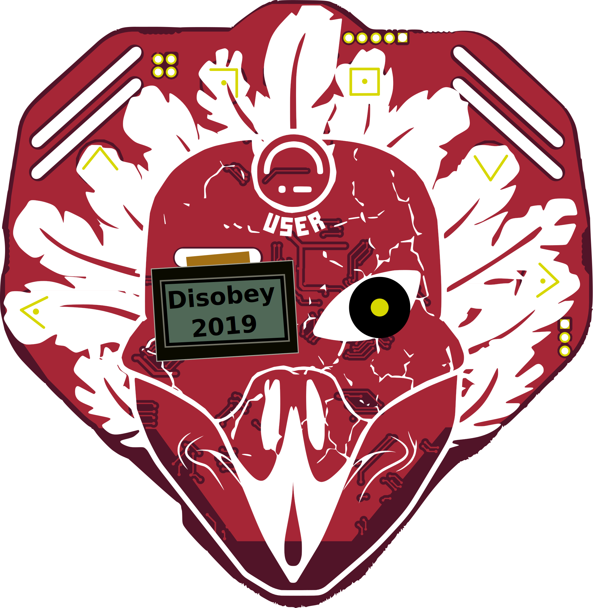

This badge has been produced for participants, sponsors, and organizers of the Finnish event Disobey in year 2019. It had a custom PCB with variations in art and color depending on the participant's ticket. It was programmed to contain pointers as part of a hacker puzzle competition. As a stand alone device after the event, the Disobey 2019 badge would be able to run micropython on its esp32.

## Getting started

Attendees received the badge along with 2 alkaline AAA 1.5V batteries, provided separately. First step was to insert the batteries, and see the badge boot. It was supposed to start up first time during the event at the venue, so it could connect to the wireless network called "badge" and download most recent version of the software. As the wireless credentials were hardcoded into the firmware, anyone who missed that window of opportunity would have to manually re-flash the badge with badge.team's micropython configured for Disobey 2019 badge. After booting correctly, the badge would allow changing the configuration of the wireless network.

The badge needs a wireless connection to access the Hatchery, where micropython applications (called eggs) are stored. Badges can be used to download the eggs directly and use them without needing to connect to a computer.

The badge can be connected to a computer via USB. It communicates via serial at 115200 baudrate. In Linux it should appear as /dev/ttyACM0 (or the first free number, higher than 0). To connect to it, you can use e.g. screen:

    screen /dev/ttyACM0 115200

Users can open the menu and navigate it, or invoke a micropython shell and live-code on the hardware. There is also an on-screen menu. There, users can trigger an OTA firmware update or change the WiFi credentials to use the badge post-event.

## Hardware

This badge has buttons, a small screen with backlight, a buzzer, and both an infrared receiver and transmitter. However, the most used feature during the event were multiple SMD RGB LEDs going around the outline of the PCB, attached to the back.

## Programming API

Most of the API is provided by the micropython and the modded version of the badge.team. For most basic micropython development, official documentation will suffice.

To program hardware-specific features, please see the following code examples that are valid for the software that badges were flashed with in 2019 before and during the event. This could have changed, if the badge has been flashed with updated badge.team micropython.

```
import badge

# to turn leds on:
# badge.led(LED_NR, R, G, B)
badge.led(0, 255, 0, 0) # set LED 0 to red
badge.led(2, 0, 0, 0) # turn LED 2 off

# backlight:
badge.backlight(255) # sets backlight to full brightness
badge.backlight(0) # turns off backlight

voltage = badge.battery_volt_sense()

# button-presses - use with ugfx:
def function(button_status):
    print("Button pressed.", button_status)
ufgx.input_init()

ugfx.input_attach(ugfx.BTN_START, button_status)

badge.off()
# use it to turn off all power-hungry stuff (samd peripherals: leds, buzzer, backlight)
# note that ir stays on

# sound:
badge.buzzer(frequency, duration)
badge.buzzer(3000, 5)

# screen rotation:
badge.lcd_set_rotation(False)
ugfx.flush()
# now screen displays, upside-down because that's how it is attached
badge.lcd_set_rotation(True)
ugfx.flush()
# now screen displays upside-down hardware-wise, right-way up for people looking at the badge

# memory:
badge.nvs_get_str()
badge.nvs_get_str('badge', 'owner', 'default')
# this returns default if nothing was stored in

badge.nvs_set_str(group, item, value)
badge.nvs_set_str('badge', 'owner', 'Jukka')

# raw i2c:
badge.i2c_read_reg()
badge.i2c_write_red()

# debugging:
# for getting raw bit value of the button being pressed
badge.read_touch()
# raw state of the badge (it's a bit value, needs a bitmap to decode)
badge.read_state()

# exit app:
import appglue
appglue.home()

# auto-Scrolling text:
import easydraw
easydraw.msg("This is a test", "Title", True)

# services:
import virtualtimers
virtualtimers.activate()

def function():
    print("Hello World")
    return 1000

virtualtimers.add(function, 500)
```
